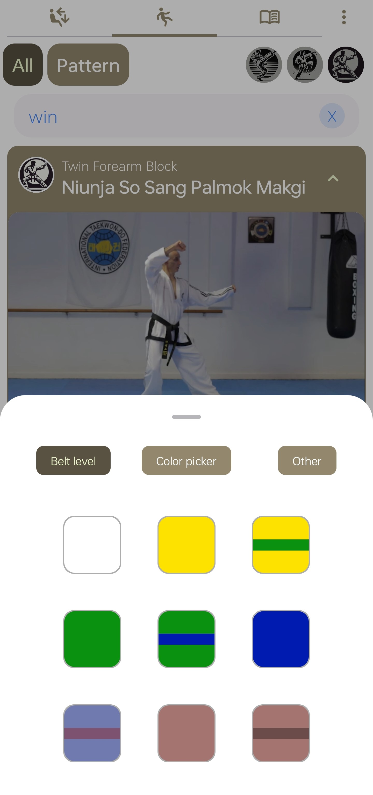
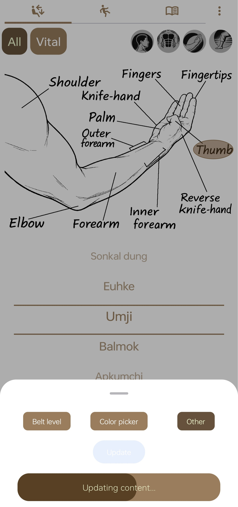

## ITF Taekwon-Do Training Support App

**This app is designed to support your ITF Taekwon-Do training.**  
Use it to **review and recall techniques** you have already learned, *not* as a tool for learning new ones.

### Screenshots

  
  

### Main Features
- Browse and search videos that show techniques, stances, and patterns by belt level and category  
- Cross-reference techniques with terminology and body parts  
- Store structured content locally using SQLite  
- Update content in-app from the cloud :globe_with_meridians:

### Download Instructions
- Download the **.apk file** for Android installation from:  
  [https://github.com/JuhaniLQ/Taekwon-Do_app/releases](https://github.com/JuhaniLQ/Taekwon-Do_app/releases)

- Or get the **latest version** directly:  
  [https://github.com/JuhaniLQ/Taekwon-Do_app/releases/download/v0.7/ITFun_v0.7_release.apk](https://github.com/JuhaniLQ/Taekwon-Do_app/releases/download/v0.7/ITFun_v0.7_release.apk)

### Tech Stack
- Kotlin  
- Jetpack Compose  
- Room (SQLite)
